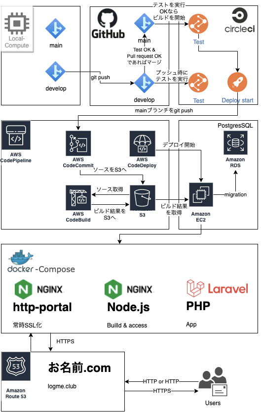

# LogMe 
### ポートフォリオ公開用リポジトリ

 

#### 毎日の日記を投稿しよう！

読書の感想や、毎日の学びなどを残しておく事ができるように作成しました。

### LogMe
https://logme.club
※予告なく停止することがあります。
※公開している物とソースが異なる場合があります。

※パスワード再設定機能に関しては現在運用を停止しております。
 

##  技術概要

- フロントエンド
  - Vue.js 2.6.12
- バックエンド
  - PHP 7.4.21
  - Laravel 6.20.26
  - PHPUnit(テスト)
  - nginx(Webサーバー)
  - RDS Postgres(データベース)
- インフラ
  - AWS(Route53, VPC, RDS, EC2)
  - AWS(CodePipline, S3, CodeCommit, CodeDeploy, CodeBuild)
  - Docker/docker-compose
  - CircleCI(バックエンドのCI/CD)
  - MailGrid(メール送信)

## infra構成

